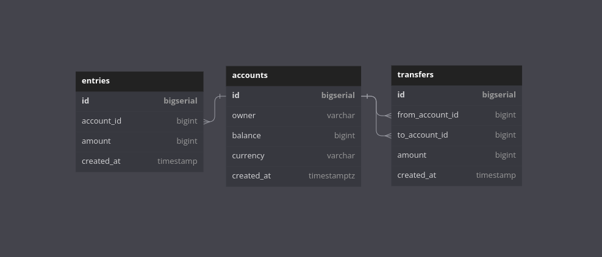

# :books: Simple bank example using GoLang

This project it's to understand the mainly tools used for language GoLang to API services, ORM, Migration and another stuffs to fixed the knowledge adquired.

## :wrench: Setup and Tools used

- GoLang 1.20
- SQLC to generate models (in discussion to check other GO ORM's)
- MigrationDB
- Docker
    - Postgres Alpine 12

This list does not complete yet, will increase with the time.

## :dart: Goals

- Understading the tools most commom used with GoLang

- Implementation using Docker to configuration in the enviroment

- Produce a front to consume the API (In discussion if Angular or VueJs)

- Try adopt the best pratices for GoLang Projects

## :floppy_disk: Database initial version

This is not definitive yet, in discussion the of domain of bussiness.